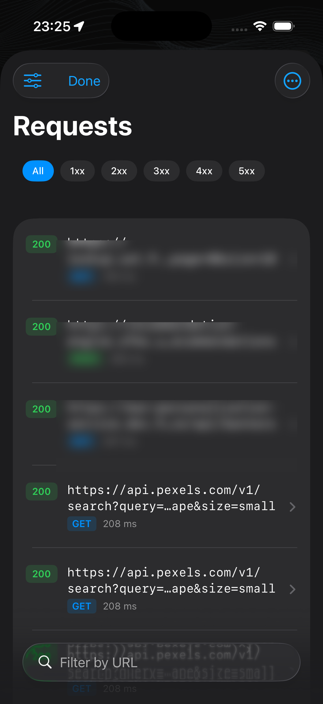
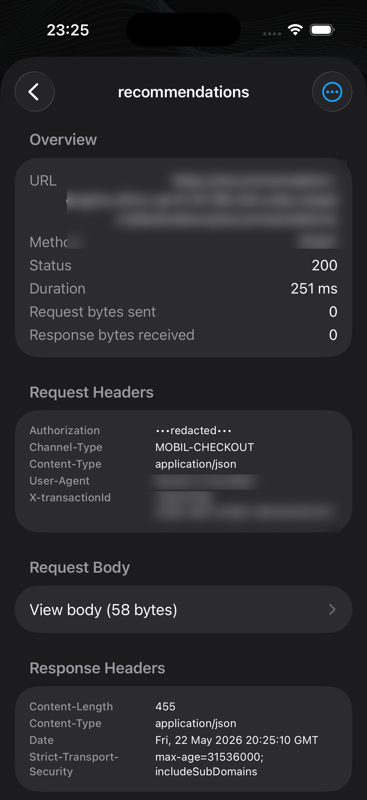
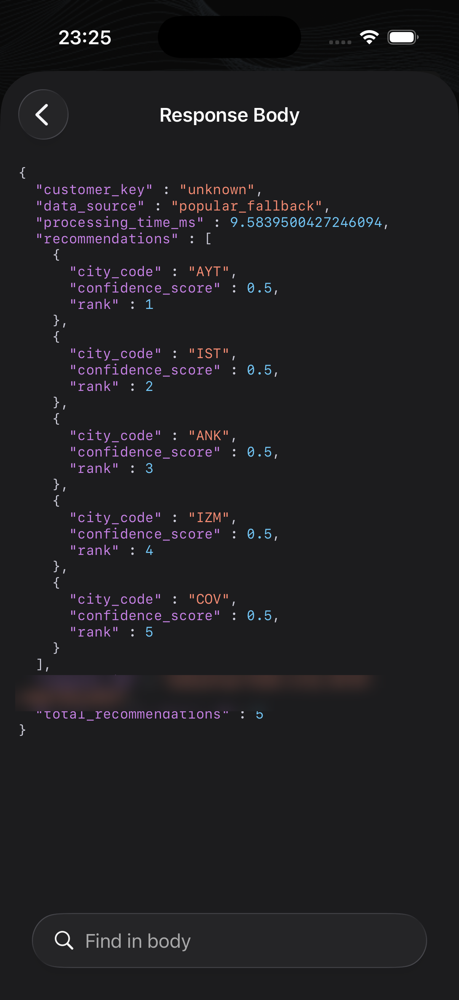
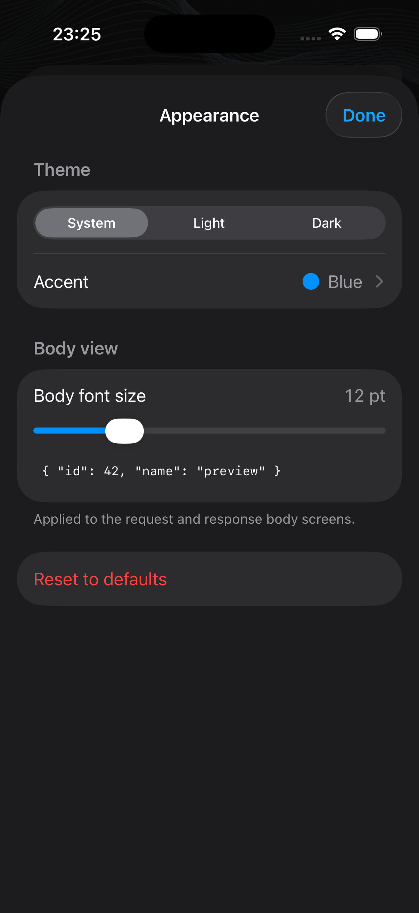
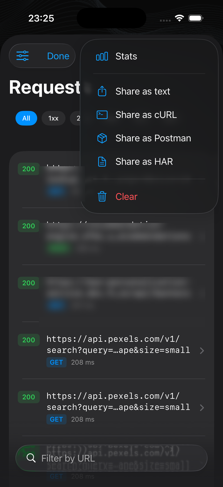

# NetworkLogger

[](https://github.com/olcayertas/network-logger/releases/latest)
[](https://swift.org)
[](https://swift.org)
[](https://swift.org/package-manager/)
[](LICENSE)

A modern Swift network-debugging library for iOS — a from-scratch rewrite of [Wormholy](https://github.com/pmusolino/Wormholy) using SwiftUI, Swift 6 strict concurrency, actors, and `URLSession` delegate proxying.

It captures HTTP requests, responses, headers, bodies, and metrics; lets you filter, share, and export as cURL / Postman / HAR / plain text; and lives behind a `NetworkLoggerView` that **you** present wherever you want.

## Screenshots

| Request list | Request detail | Response body |
|:-:|:-:|:-:|
|  |  |  |

| Appearance | Share / export |
|:-:|:-:|
|  |  |

## Why a rewrite

Wormholy is great. NetworkLogger keeps every feature you actually use and drops two architectural pillars that fight modern apps:

| Wormholy | NetworkLogger |
|---|---|
| Walks `UIApplication.shared.connectedScenes → keyWindow → rootViewController` to push its UI | You present `NetworkLoggerView(logger:)` like any SwiftUI view — `.sheet`, `NavigationLink`, fullscreen, tab, inline |
| Shake-to-trigger NSNotification (`wormholy_fire`) is hardwired | No notifications, no shake handler, no global state — wire up whatever trigger you want |
| Method-swizzles `NSURLSessionConfiguration` from an ObjC constructor | Pure-Swift `URLSession` delegate proxy you opt into per session |
| Singleton `Storage.shared`, `@Published` reference types, `DispatchQueue.main.async` updates | `actor EventStore`, `Sendable` value types, Swift 6 strict concurrency |
| `Wormholy.limit` getter that returns `nil` synchronously while doing a `Task { @MainActor in return ... }` | Real async API |

## Installation

Swift Package Manager:

```swift
.package(url: "https://github.com/olcayertas/network-logger", from: "0.1.0")
```

Add one (or more) of the products to your target:

| Product | Pulls in | When to use |
|---|---|---|
| `NetworkLogger` | swift-perception, swift-sharing | Always — core library and minimal UI. |
| `NetworkLoggerDependencies` | the above + swift-dependencies | If you want `@Dependency(\.networkLogger)` everywhere. |
| `NetworkLoggerMediaViewers` | the above + WebKit + PDFKit | Inline image / HTML / PDF body previews. |
| `NetworkLoggerLogHandler` | the above + swift-log | Route swift-log into the Console tab. |

iOS 16+ (uses the [Perception](https://github.com/pointfreeco/swift-perception) library to back-port `@Observable`). The Swift package targets iOS 16 and macOS 13; UI is iOS-only.

## Documentation

The full DocC catalog is published with the package — open it in Xcode via Product → Build Documentation. Key articles:

- **Getting Started** — install, three-line quickstart, exclude from Release.
- **Capturing network traffic** — delegate proxy, URLProtocol, manual `record(_:)`.
- **Filtering and searching** — structured tokens, date range, pins, recents.
- **Persistence and sessions** — file-backed mode via swift-sharing.
- **Exporting captures** — HAR, Postman, cURL, plain text.
- **swift-log integration** — Console tab + bootstrap.
- **JWT viewer** — detect, decode, jwt.io-style display.

### Excluding from Release builds

Add to your `Release.xcconfig` (or each non-debug target's build settings):

```
EXCLUDED_SOURCE_FILE_NAMES = NetworkLogger*
```

No constructor-time side effects, so the library is inert if you just skip wiring it up.

## Quick start

```swift
import NetworkLogger

// 1. Create an instance — no singleton.
let logger = NetworkLogger(configuration: .init(
    limit: 500,
    ignoredHosts: ["analytics.example.com"]
))

// 2. Build a pre-wired session and route requests through it.
let session = logger.makeLoggingURLSession()
let (data, response) = try await session.data(for: request)

// 3. Present the inspector wherever you want.
.sheet(isPresented: $showInspector) {
    NetworkLoggerView(logger: logger)
}
```

`makeLoggingURLSession()` is the shortest path — one line, full body / header / metrics capture, cancellation forwarded. If you need to keep your own `URLSession` (custom configuration, your own delegate, etc.) use the manual delegate-proxy path described under **Recording modes** below.

## Recording modes

Three complementary ways to feed events into a logger. Pick one or combine them.

### 1. `LoggingURLSession` (recommended)

```swift
let session = logger.makeLoggingURLSession()
let (data, response) = try await session.data(for: request)
```

`makeLoggingURLSession()` returns a `LoggingURLSession` actor that:

- Owns a `URLSession` whose delegate is `LoggingURLSessionDelegate` (full callback forwarding).
- Drives requests via `dataTask(with:).resume()` + a `CheckedContinuation` glue (`TaskResultSink`) so the data-delegate callbacks fire reliably — even on iOS 26, where `URLSession.data(for:delegate:)` no longer delivers `URLSessionDataDelegate` events to the per-task delegate.
- Forwards Swift `Task` cancellation to the underlying `URLSessionDataTask`.
- Bounds memory with a configurable `bodyCaptureLimit` (1 MiB default).

Captures everything the inspector needs: request body, response body + headers, metrics, redirects, auth challenges.

### 1b. Manual delegate proxy (advanced)

If you already have a custom `URLSession` (your own configuration, pinned transport, existing delegate) and want to keep it, install the logger as a forwardee on your own delegate:

```swift
let delegate = await logger.makeSessionDelegate(forwardingTo: myDelegate)
let session = URLSession(configuration: .default, delegate: delegate, delegateQueue: nil)
```

`logger.makeSessionDelegate(forwardingTo:)` returns a `URLSessionDelegate` that records every callback then forwards to your real delegate via Objective-C message forwarding (`responds(to:)` + `forwardingTarget(for:)`). Works with:

- Upload progress (`didSendBodyData:`)
- SSL pinning / server-trust (`didReceive challenge:`)
- HTTP redirects (`willPerformHTTPRedirection:`)
- Multipart bodies (combined with `BodyStreamTee`)
- `URLSessionStreamDelegate` / `URLSessionWebSocketDelegate` — forwarded without any code from us

Limitation: the URLSession **async/await convenience APIs** (`session.data(from:)`, `session.data(for:)` without a per-task delegate) consume the data delegate methods internally on iOS 26, so the session delegate only sees `task` and `auth` events. Use `dataTask(with:).resume()` + a delegate-driven completion, or just use `makeLoggingURLSession()` which already does this for you.

### 2. Manual recording

For gRPC, WebSocket, or any traffic that doesn't go through `URLSession`:

```swift
let event = NetworkEvent(
    request: .init(
        url: URL(string: "grpc://api.example.com/GetUser")!,
        httpMethod: "POST",
        headers: ["Content-Type": "application/grpc+proto"],
        body: BodyData(data: payload)
    ),
    response: .init(statusCode: 0, body: BodyData(data: reply)),
    metrics: .init(duration: 0.085),
    state: .completed
)
await logger.record(event)
```

### 3. URLProtocol fallback (third-party SDKs)

When you can't reach the URLSession (a closed-source SDK owns it), opt into the global URLProtocol:

```swift
let configuration: URLSessionConfiguration = .default
logger.attach(to: configuration)            // installs LoggingURLProtocol on this config
URLProtocol.registerClass(logger.urlProtocolClass)  // or globally, if you must
```

Limitations baked into Apple's URLProtocol design:

- Cannot forward `didSendBodyData:` for streamed uploads (Wormholy bug #77 — an Apple-level limitation, not ours).
- Background sessions are unsupported.
- The challenge handler always calls its completion handler with `.performDefaultHandling` (fixes Wormholy #157's "API misuse" warning by construction).

## Presenting the UI

`NetworkLoggerView(logger:)` is a plain SwiftUI view that builds its own `NavigationStack`. Drop it wherever:

```swift
// Sheet
.sheet(isPresented: $show) { NetworkLoggerView(logger: logger) }

// Push
NavigationLink("Network Logs") {
    NetworkLoggerView(logger: logger)
}

// Full-screen cover
.fullScreenCover(isPresented: $show) { NetworkLoggerView(logger: logger) }

// Tab in a debug menu
TabView { NetworkLoggerView(logger: logger).tabItem { ... } }
```

The library ships **no** shake-to-present helper, **no** floating overlay button, and **no** NSNotification trigger. Wire up your own trigger — see `Examples/NetworkLoggerDemo` for several patterns.

## Customizing the UI

`NetworkLoggerView` carries a slider icon in its leading nav-bar position. Tap it to open the **Appearance** sheet — settings persist to `UserDefaults` so they survive across launches.

| Setting | What it does |
|---|---|
| **Color scheme** | Forces `System` / `Light` / `Dark` on the inspector independent of the host app, via `.preferredColorScheme(...)` at the root. |
| **Accent** | Picks the inspector's tint (Blue / Indigo / Purple / Teal / Green / Orange / Pink). Applied via `.tint(...)` so the host app's accent doesn't bleed into chips and buttons. |
| **Body font size** | Slider 9 – 22 pt (default 12 pt). Live preview in the sheet. Applied to the request and response body screens. |
| **Reset to defaults** | One-tap restore. |

### Programmatic access

`AppearanceSettings.shared` is the singleton the UI reads from. You can pre-seed it at app startup (e.g. to force dark mode on internal builds):

```swift
import NetworkLogger

AppearanceSettings.shared.colorScheme = .dark
AppearanceSettings.shared.accent = .indigo
AppearanceSettings.shared.bodyFontSize = 11
```

### Syntax highlighting

Pretty-printed JSON bodies are token-coloured (keys, strings, numbers, booleans, `null`, punctuation) in both the request and response body views. Two palettes ship out of the box and are picked automatically based on the active color scheme:

```swift
SyntaxTheme.lightDefault    // Xcode-ish, tuned for paper-white surfaces
SyntaxTheme.darkDefault     // higher saturation, tuned for dark surfaces
```

Build a custom palette with the `SyntaxTheme(key:string:number:boolean:null:punctuation:)` initialiser. Non-JSON bodies (XML, plain text, binary placeholders) skip the highlighter and render unstyled — the scanner never throws on malformed input.

Search highlighting (yellow background from the search field) composes on top of syntax colours, so finding text inside a coloured body does not erase the syntax run for the rest of the response.

## Using with Point-Free's Dependencies (optional)

The optional `NetworkLoggerDependencies` product registers `NetworkLogger` as a [swift-dependencies](https://github.com/pointfreeco/swift-dependencies) value, so you can configure once at app startup and read the configured instance from anywhere with `@Dependency(\.networkLogger)` — no prop drilling, no global singleton.

**Add the product** to your target:

```swift
.product(name: "NetworkLoggerDependencies", package: "network-logger")
```

**Configure once** at app startup:

```swift
import NetworkLogger
import NetworkLoggerDependencies
import Dependencies
import SwiftUI

@main
struct MyApp: App {
    init() {
        prepareDependencies {
            $0.networkLogger = NetworkLogger(configuration: .init(
                limit: 500,
                ignoredHosts: ["analytics.example.com"]
            ))
        }
    }

    var body: some Scene {
        WindowGroup { ContentView() }
    }
}
```

**Read it anywhere**:

```swift
struct DebugMenuView: View {
    @Dependency(\.networkLogger) var logger
    @State private var showLogs = false

    var body: some View {
        Button("Network logs") { showLogs = true }
            .sheet(isPresented: $showLogs) {
                NetworkLoggerView(logger: logger)
            }
    }
}
```

Or use the bundled `NetworkLoggerInspector()` view, which pulls the dependency for you:

```swift
.sheet(isPresented: $showLogs) {
    NetworkLoggerInspector()
}
```

**Override for tests / previews** like any Dependencies-managed value:

```swift
withDependencies {
    $0.networkLogger = NetworkLogger()
} operation: {
    // ... test or preview code that consumes @Dependency(\.networkLogger)
}
```

This module is opt-in. If you don't import `NetworkLoggerDependencies`, swift-dependencies is never pulled into your dependency graph.

## Configuration

```swift
NetworkLoggerConfiguration(
    limit: 500,                          // ring buffer size
    ignoredHosts: ["analytics.example.com"],
    defaultFilter: "/api/v2",            // pre-fill the search box
    bodyCaptureLimit: 1_048_576,         // 1 MiB body cap with truncation flag
    headerRedactor: Redaction.makeHeaderRedactor(),  // redacts Authorization, Cookie, ...
    responseTransformer: { data, request in
        // decrypt, decompress, anything you want
        return MyCrypto.decrypt(data)
    }
)
```

Runtime mutation:

```swift
await logger.setLimit(1000)
await logger.setIgnoredHosts(["new.host"])
await logger.setDefaultFilter("/v3/")
await logger.replaceConfiguration(newConfig)
```

## Exporters

```swift
let events = await logger.snapshot()

CurlExporter.string(for: events)                       // multiline cURL commands
PostmanExporter.collection(name: "MyApp", from: events) // Postman 2.1 JSON
PlainTextExporter.text(for: events)                    // human-readable text
HARExporter.har(from: events)                          // HAR 1.2 JSON
```

The built-in UI wires these into `ShareLink` automatically (Save to Files, Mail, Messages, etc.).

## Filters

```swift
let combined = CompositeFilter(
    URLSubstringFilter("/users"),
    MethodFilter("POST"),
    StatusCodeRangeFilter.clientError,
    HostFilter(blocking: ["staging.example.com"])
)
let problems = (await logger.snapshot()).filtered(by: combined)
```

Built-ins: `URLSubstringFilter`, `MethodFilter`, `HostFilter`, `StatusCodeRangeFilter`, `CompositeFilter` (AND), `AnyOfFilter` (OR), `NotFilter`. All `Sendable`. Implement your own by conforming to `EventFilter`.

## Wormholy issue map

| Wormholy issue | NetworkLogger resolution |
|---|---|
| #157 SSL pinning "API MISUSE" | Delegate proxy forwards `didReceive challenge:` to your delegate; URLProtocol mode always calls the completion handler. |
| #147 Empty request body | `BodyStreamTee` clones `httpBodyStream` for the URLProtocol path. The delegate proxy captures from `task.originalRequest.httpBody`, which URLSession preserves. |
| #146 Custom logs (gRPC) | Public `record(_:)` API. |
| #144 Debug-only SPM | `EXCLUDED_SOURCE_FILE_NAMES = NetworkLogger*` per Release config — no library code change needed since there's no constructor side effect. |
| #132 Custom cell content | (Roadmap) cell row override via `RequestListView` initializer. |
| #130 Decrypt response | `Configuration.responseTransformer`. |
| #125 Response mocking (Proxyman-style) | Roadmap (stretch goal). |
| #114 Static linking | ObjC constructor + method swizzling removed entirely. Works by construction. |
| #93 Multipart bodies | Same `BodyStreamTee` path as #147. |
| #77 Alamofire/upload progress | Delegate-proxy mode forwards `didSendBodyData:` to your delegate. URLProtocol mode preserves Apple's limitation but documents it. |

## Concurrency model

- All public mutable state is in an `actor` (`EventStore`, `ConfigurationStore`, per-task `SessionRecorder`).
- `NetworkEvent` and its components are `struct, Sendable` value types.
- `LoggingURLSessionDelegate` is `NSObject, @unchecked Sendable` (URLSession requires NSObject; isolation is enforced by routing all state mutations through the recorder actor).
- UI uses `@Perceptible` (Perception library) `@MainActor` view models subscribed to `logger.eventStream()`.
- No `DispatchQueue.main.async`, no `@Published` on reference types, no implicit globals.

Builds clean under `-strict-concurrency=complete` on Swift 6.

## License

MIT — same as Wormholy.
